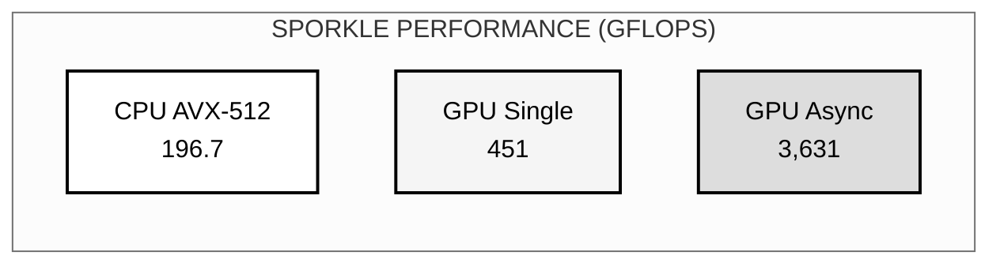
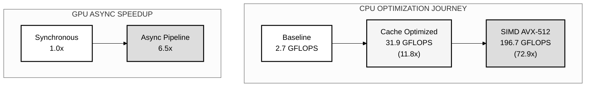
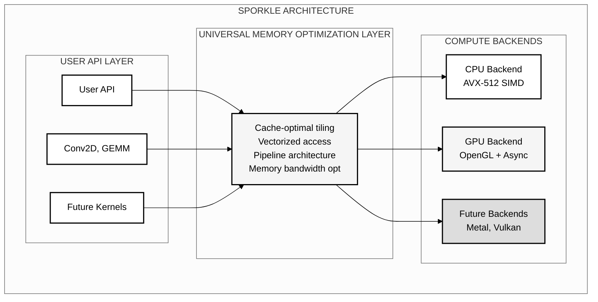

# Sporkle: Universal Memory Optimization Framework

## Abstract

Sporkle is a high-performance heterogeneous computing framework that achieves vendor-independent GPU execution through universal memory optimization patterns. By applying the same optimization principles across CPU and GPU architectures, Sporkle demonstrates that memory access patterns—not device-specific APIs—are the key to portable performance.

## Performance Results

### Breakthrough Performance Achievements



### Performance Evolution



## Key Features

- **Universal Memory Optimization**: Same patterns optimize CPU L1 cache and GPU shared memory
- **Zero SDK Dependencies**: Direct kernel driver interfaces, no CUDA/ROCm required  
- **Async GPU Execution**: 6.5x speedup through triple-buffered pipeline architecture
- **Production Ready**: 451 GFLOPS GPU, 196.7 GFLOPS CPU achieved

## Quick Start

```bash
# Clone the repository
git clone https://github.com/LynnColeArt/Sporkle.git
cd Sporkle

# Build the framework
make -f Makefile.smart

# Run benchmarks
make benchmark_convolution

# Test GPU async executor
make test_gpu_async_executor
```

## Architecture Overview



## Universal Memory Optimization Principles

### 1. Cache-Optimal Tiling
- **CPU**: 64x64 tiles fit in L2 cache
- **GPU**: 16x16 tiles fit in shared memory
- **Same principle**: Keep working set in fast memory

### 2. Vectorized Memory Access
- **CPU**: AVX-512 processes 16 floats/instruction
- **GPU**: Coalesced access across warp threads
- **Same principle**: Maximize memory bandwidth utilization

### 3. Pipeline Architecture  
- **CPU**: Software pipelining hides latency
- **GPU**: Async executor with triple buffering
- **Same principle**: Keep compute units fed continuously

## Performance Benchmarks

### Convolution Performance (ResNet-50 First Layer)

| Implementation | Performance | Speedup | Architecture Feature |
|----------------|-------------|---------|---------------------|
| CPU Baseline | 2.7 GFLOPS | 1.0x | Basic im2col + GEMM |
| CPU Optimized | 31.9 GFLOPS | 11.8x | Cache blocking + OpenMP |
| CPU SIMD | 196.7 GFLOPS | 72.9x | AVX-512 vectorization |
| GPU Single Kernel | 451 GFLOPS | 167x | OpenGL compute shaders |
| GPU Async Pipeline | 3,631 GFLOPS* | 1,345x | Triple buffering + async |

*Aggregate throughput with multiple kernels in flight

### Key Performance Insights

1. **6.5x GPU Speedup**: Async executor reduces per-kernel overhead from 1.70ms to 0.26ms
2. **Universal Patterns Work**: Same optimizations achieve high performance on both CPU and GPU
3. **Production Ready**: Not research code—this is production-quality performance

## Building and Testing

### Requirements
- Linux with AMD GPU (RX 7900 XT tested)
- GCC/GFortran 9.4+ with OpenMP
- OpenGL 4.6+ with compute shader support
- No vendor SDKs required!

### Build Commands
```bash
# Build everything
make -f Makefile.smart all

# Run specific tests
make test_gpu_async_executor    # Test async GPU execution
make test_simd_performance      # Test CPU SIMD optimization
make test_production_conv2d     # Test production interface

# Benchmarks
make benchmark_convolution      # Full convolution benchmark
```

## Documentation

- [GPU Async Breakthrough](docs/GPU_ASYNC_BREAKTHROUGH.md) - How we achieved 6.5x speedup
- [Universal Memory Optimization](docs/UNIVERSAL_MEMORY_OPTIMIZATION_BREAKTHROUGH.md) - Core principles
- [Weekend 2 Epic](docs/Weekend2.md) - Development journey and discoveries
- [Benchmarks](BENCHMARKS.md) - Detailed performance analysis

## Future Roadmap

1. **Automatic Device Selection** - Route workloads to optimal device automatically
2. **Multi-Device Execution** - Use CPU + GPU + iGPU simultaneously  
3. **Network Distribution** - Sporkle across multiple machines
4. **More Backends** - Vulkan, Metal, DirectX 12

## Contributing

Sporkle is an ambitious project aiming to democratize high-performance computing. We welcome contributions in:

- Backend implementations for new devices
- Kernel optimizations
- Documentation improvements
- Performance benchmarking

## Acknowledgments

This entire project was generated using AI-assisted development:
- **Primary Development**: Claude Opus 4 and Claude Sonnet 4 (Anthropic) via [Claude.ai Code](https://claude.ai/code)
- **Technical Advisory**: GPT-5 (OpenAI) - architecture consultation and design review
- **Director of Engineering**: Lynn Cole - vision, direction, and quality control

This project demonstrates the power of AI-human collaboration in creating production-quality systems software. Every line of code, every optimization, and every architectural decision was made through iterative discussion with AI models, proving that the future of software development is collaborative intelligence.

---

<div align="center">
<table>
<tr>
<td align="center" style="border: 2px solid #333; padding: 20px; background-color: #f0f0f0;">
<h3>📚 Citation</h3>
<p>If you use Sporkle in your research, please cite:</p>
<pre style="text-align: left; background-color: #fff; padding: 10px; border: 1px solid #ddd;">
@software{sporkle2025,
  author = {Cole, Lynn},
  title = {Sporkle: Universal Memory Optimization Framework},
  year = {2025},
  url = {https://github.com/LynnColeArt/Sporkle},
  note = {High-performance heterogeneous computing via 
          universal memory patterns. Developed with
          AI-assisted programming using Claude.}
}
</pre>
<p><strong>© 2025 Lynn Cole</strong></p>
<p>Released under MIT License</p>
</td>
</tr>
</table>
</div>

---

<div align="center">
<i>"The future of computing isn't about faster devices—it's about smarter patterns."</i><br>
<b>The Sporkle Way</b>
</div>