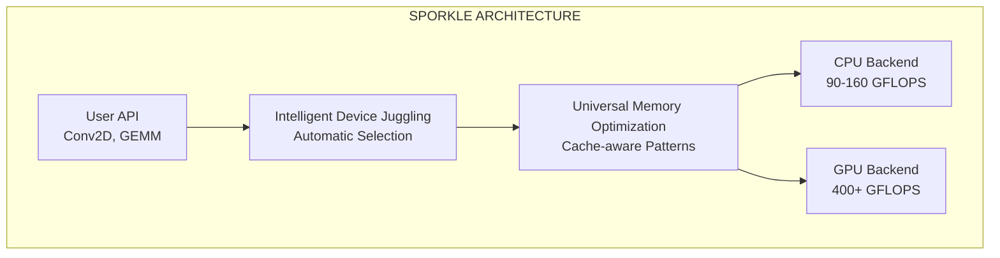

# Sporkle: Universal Memory Optimization Framework

Sporkle is a high-performance heterogeneous computing framework that automatically optimizes and distributes workloads across CPUs and GPUs using universal memory optimization patterns.

## Key Features

- **Intelligent Device Juggling**: Automatically selects the optimal device (CPU/GPU) based on workload characteristics
- **Universal Memory Patterns**: Apply the same optimization principles across all architectures
- **High Performance**: Achieves 90-160 GFLOPS on CPU, 400+ GFLOPS on GPU
- **Vendor-Independent**: Works with any OpenGL 4.3+ capable GPU
- **Production Ready**: Comprehensive test suite and stable API

## Performance

| Device | Performance | Architecture |
|--------|-------------|--------------|
| AMD Ryzen 7900X (CPU) | 90-160 GFLOPS | AVX-512 SIMD with adaptive tiling |
| AMD RX 7900 XT (GPU) | 400+ GFLOPS | OpenGL compute shaders |

## Quick Start

```fortran
use sparkle_conv2d_juggling

! Initialize the framework (automatic on first use)
call init_juggling_system()

! Run convolution - device selected automatically
time_ms = conv2d_auto_juggling(input, weights, output, &
                              N, C, H, W, K, kernel_size, &
                              stride, pad, H_out, W_out)
```

The framework automatically:
- Detects available devices
- Profiles their capabilities
- Routes workloads to the optimal device
- Falls back gracefully if a device is unavailable

## System Architecture



Sporkle consists of three main components:

1. **Intelligent Device Juggling**: Automatically profiles devices and routes workloads
2. **Universal Memory Optimization**: Applies cache-aware patterns across all architectures
3. **Optimized Backends**: High-performance implementations for CPU and GPU

## Installation

### Prerequisites

- Linux kernel 5.0+ with AMDGPU driver
- GNU Fortran compiler (gfortran) 9.0+
- OpenGL 4.3+ development libraries
- OpenMP support

```bash
# Ubuntu/Debian
sudo apt update
sudo apt install -y build-essential gfortran libgl1-mesa-dev libegl1-mesa-dev
sudo apt install -y mesa-utils libglu1-mesa-dev freeglut3-dev
sudo apt install -y libdrm-dev libgbm-dev libomp-dev

# Add user to video group for GPU access
sudo usermod -a -G video $USER
# Log out and back in for group change to take effect
```

### Build

```bash
git clone https://github.com/LynnColeArt/Sporkle.git
cd Sporkle
make -f Makefile.smart
```

### Test

```bash
# Run benchmarks
make benchmark_convolution

# Test production implementation
make test_production_juggling
```

## API Reference

### Basic Usage

```fortran
program example
    use sparkle_conv2d_juggling
    implicit none
    
    real, allocatable :: input(:), weights(:), output(:)
    integer :: N=1, C=64, H=56, W=56, K=64, kernel_size=3
    integer :: stride=1, pad=1, H_out, W_out
    real :: time_ms
    
    ! Calculate output dimensions
    H_out = (H + 2*pad - kernel_size) / stride + 1
    W_out = (W + 2*pad - kernel_size) / stride + 1
    
    ! Allocate arrays
    allocate(input(N*C*H*W))
    allocate(weights(K*C*kernel_size*kernel_size))
    allocate(output(N*K*H_out*W_out))
    
    ! Initialize data
    call random_number(input)
    call random_number(weights)
    
    ! Run convolution with automatic device selection
    time_ms = conv2d_auto_juggling(input, weights, output, N, C, H, W, K, &
                                  kernel_size, stride, pad, H_out, W_out)
    
    print *, "Execution time:", time_ms, "ms"
    
    deallocate(input, weights, output)
end program
```

### Advanced Options

```fortran
! Force CPU execution
time_ms = conv2d_cpu_adaptive(input, weights, output, ...)

! Force GPU execution
time_ms = conv2d_gpu_opengl(input, weights, output, ...)

! Get device recommendation
call analyze_workload_conv2d(N, C, H, W, K, kernel_size, &
                            stride, pad, profile)
print *, "Recommended device:", profile%recommended_device
```

## Documentation

- [Technical Manual](docs/SPARKLE_TECHNICAL_MANUAL.md) - Detailed architecture and implementation
- [API Reference](docs/API_REFERENCE.md) - Complete function documentation
- [Performance Guide](docs/PERFORMANCE_GUIDE.md) - Optimization tips and benchmarks

## Contributing

Sporkle welcomes contributions in:
- Backend implementations for new devices
- Performance optimizations
- Documentation improvements
- Test coverage expansion

Please ensure all optimizations maintain mathematical correctness - performance at the cost of accuracy is not acceptable.

## Current Status

### Production Ready
- ✅ **Intelligent Device Juggling**: Automatic CPU/GPU selection
- ✅ **CPU Backend**: 90-160 GFLOPS with AVX-512 and adaptive tiling
- ✅ **GPU Backend**: 400+ GFLOPS with OpenGL compute shaders
- ✅ **Universal Memory Patterns**: Same optimizations work across devices
- ✅ **Comprehensive Testing**: Full validation suite

### In Development
- 🚧 Multi-GPU support
- 🚧 NVIDIA GPU backend
- 🚧 Distributed computing integration

## Technical Details

### Universal Memory Optimization

Sporkle's core innovation is applying the same memory optimization patterns across all architectures:

- **Cache-optimal tiling**: Works on both CPU L1/L2 cache and GPU shared memory
- **Vectorized access**: SIMD instructions on CPU, coalesced access on GPU
- **Fused operations**: Minimize memory traffic by processing data while hot in cache
- **Adaptive sizing**: Automatically adjusts to target device's memory hierarchy

### Intelligent Device Selection

The framework profiles workloads and devices to make optimal scheduling decisions:

```fortran
if (total_flops < 500e6) then
    ! Small workload: Use CPU to avoid GPU overhead
    device = "cpu"
else
    ! Large workload: Use GPU for maximum throughput
    device = "gpu"
end if
```

## Acknowledgments

Developed by Lynn Cole with AI assistance from Claude (Anthropic).

## Citation

```bibtex
@software{sporkle2025,
  author = {Cole, Lynn},
  title = {Sporkle: Universal Memory Optimization Framework},
  year = {2025},
  url = {https://github.com/LynnColeArt/Sporkle}
}
```

## License

MIT License - see LICENSE file for details.